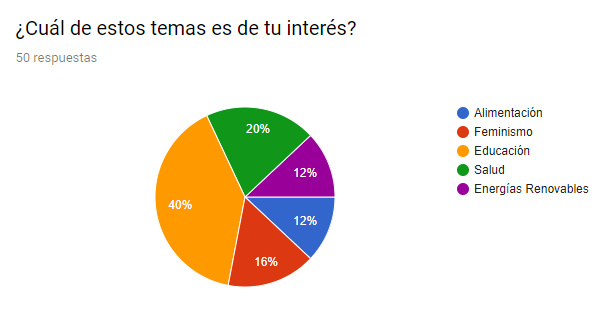

# Creando una Red Social

## Integrantes

* Maricruz Enrique Rivera
* Mary Katty Vicuna Ore
* Patricia Vidal

## Preámbulo

Instagram, Snapchat, Twitter, Facebook, Twitch, Linkedin, etc. Las redes
sociales han invadido nuestras vidas. Las amamos u odiamos, y muchxs no podemos
vivir sin ellas.

Hay redes sociales de todo tipo y para todo tipo de intereses. Por ejemplo,
en una ronda de financiamiento con inversionistas, se presentó una red social
para químicos en la que los usuarios podían publicar artículos sobre sus
investigaciones, comentar en los artículos de sus colegas, y filtrar artículos
de acuerdo a determinadas etiquetas o su popularidad, lo más reciente, o lo
más comentado.

## Introducción

Este proyecto se enfoca crear una red social, para lo cual usaremos 
herramientas como: Google Forms ( para realizar las encuestas), entrevistas, sketch
(diseños a lapiz y papel), figma (para el diseño del prototipo en alta fidelidad 
tanto para mobiles, tablets como para la web), posterior al diseño definido, usaremos
HTML (un lenguaje de marcardo, nos servirá para construir la estructura la red social),
Boostrap ( framework que nos será de gran ayuda para darle estilos a nuestro proyecto), 
y finalmente JavaScript (este lenguaje de programación nos servirá para darle funcionalidad).

## Sprint 1

Tomando como punto de partida los requerimientos del cliente, realizamos el Sprint Planning 
de la semana, con sus respectivas épicas, tal como se muestra en la siguiente imagen.

### Encuesta 

Realizamos una encuesta a 50 personas de nuestro entorno y a la vez algunos que eran del 
entorno de ellos, obtuvimos los siguientes resultados:

  [Abrir encuesta aquí](https://goo.gl/forms/qDz2VB1k2nCl5zp12)

    
    
    
    
    
    
    
    
    

***

### Resultados en base a la encuesta

* Tomando en cuenta las elecciones de los usuarios, el tema de la red social será sobre EDUCACIÓN 
  
### Diagrama de flujo del proyecto
  
*  Se realizó un diagrama de flujo enfocándonos en los pasos que seguiría una persona que está 
   interesada en usar la red social.

   

### Sketch

  
  
  

  ***

## Checklist

### General

* [ ] Producto final sigue los lineamientos del diseño.

### `README.md`

* [ ] Definición del producto:
  * [ ] Cuáles son los elementos básicos que tiene una red social.
  * [ ] Quiénes son los principales usuarios de producto.

  * [ ] Cómo descubriste las necesidades de los usuarios.

    > Realizamos una encuesta a un total de 50 personas de distintas edades, de los cuales obtuvimos 
    > como resultado que la mayoría de ellos está de acuerdo con que exista una red social sobre EDUCACIÓN, 
    > otros temas que nos arrojó la encuesta son las redes sociales más usadas hasta el momento, podríamos esto 
    > considerar como una amenza (Realizando el análisis FODA) si lo vemos como competencia y analizar su forma 
    > de trabajo; pero también podemos verlo como una oportunidad, porque podemos tomar esas redes como puntos 
    > donde también el usuario pueda compartir los post, dando visibilidad tanto nuestra red social, como su post.

  * [ ] Qué problema resuelve el producto para estos usuarios.

    >  

  * [ ] Cuáles son los objetivos de estos usuarios en relación con el producto.
  * [ ] Cuáles son las principales funcionalidades del producto y cuál es su prioridad.
  * [ ] Cómo verificaste que el producto les está resolviendo sus problemas.
  * [ ] Cómo te asegurarás que estos usuarios usen este producto.
* [ ] Benchmark de las principales redes sociales.
* [ ] Resumen de entrevistas con usuarios.
* [ ] Link/screenshots del prototipo de alta fidelidad.
* [ ] Conclusiones de testing con el prototipo de alta fidelidad con usuarios.
* [ ] Conclusiones de testing con el producto en HTML.

### Pruebas / tests

* [ ] Tests unitarios cubren un mínimo del 70% de statements, functions, lines y branches.
* [ ] Pasa tests (y linters) (`npm test`).

### Creación de cuenta (sign up)

* [ ] Permite crear cuenta.
* [ ] Valida email.
* [ ] Valida password.
* [ ] Muestra mensajes de error.

### Inicio de sesión (sign in)

* [ ] Permite iniciar sesión.
* [ ] Valida email.
* [ ] Valida password.
* [ ] Muestra mensajes de error.

### Muro (wall/feed)

* [ ] Muestra _muro_.
* [ ] Permite publicar nuevos posts.
* [ ] Permite eliminar posts.
* [ ] Pide confirmación antes de borrar posts.
* [ ] Permite editar posts (in place).
* [ ] Permite publicar y filtrar posts por público/yo.
* [ ] Permite dar _like_ a los posts y llevar un conteo de ellos.
